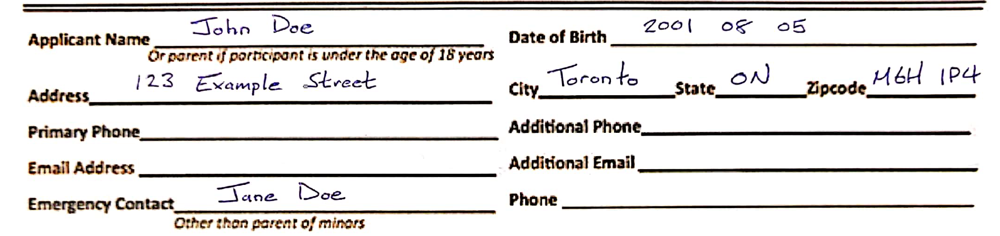

# README

Proof of concept design for system to digitize scanned documents.
Current version loads scanned documents, processes text with Google Vision API, then associates content with features.

## Example

For a given blank form,


with handwritten content,



the content can be extracted,


then content can be associated with the features,


then outputted into a table (for example),

```
             Feature              Content
             Zipcode             M6H 194 
               State                  ON 
       Date of Birth          2001 08 05 
                City             Toronto 
      Applicant Name            John Doe 
   Emergency Contact            Jane Doe 
             Address  123 Example Street 
```
